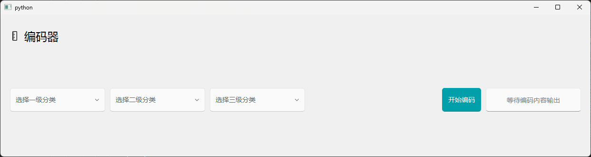

# Python_product-encoder

## 📖 写在最前面
> 该项目基于 Python 3.10.8 开发，使用 PyQt5 作为 UI 框架，公司内部相关数据以用虚拟数据代替。

---

## ⚙️ 介绍
> 一个用于生成内部产品编码的小程序，用于配合内部plm系统使用

---

## 📌 主要功能
- ✅ 功能 1：为成品生成符合要求的plm编码
- ✅ 功能 2：为成品对应的半成品生成对应内部工序的plm编码
- ✅ 功能 3：为半成品对应的原材料生成符合要求的plm编码

---

## 🆕 最近更新
| 日期 | 版本 | 变更摘要 |
|------|------|----------|
| 2025-07-28 | v1.2.0 | 修改部分编码规则，并添加部分错误提醒 |
| 2025-07-28 | v1.1.0 | 修改UI避免组件位置变动 |

---

## 🛠️ 技术栈
- Python PyQt5 GUI

---

## 🚀 快速开始
1. 克隆仓库  
   ```bash
   git clone https://github.com/yijiu2333/Python_produce-encoder.git
   cd Python_produce-encoder
   ```

2. 安装依赖
   ```bash
   python -m venv venv
   venv\Scripts\activate
   pip install -r requirements.txt
   ```

3. 本地启动
   ```bash
   python main.py
   ```
---

## 🖼️ 程序总览
   

---

## 🚫 版权说明
   - 整体项目：以 GPL-3.0 许可证发布（详见 LICENSE）
   - 第三方组件：
        - 界面框架 PyQt-Fluent-Widgets 采用 GPL-3.0，其源码已按许可证要求随附于 third_party/ 目录。
        - 其余引用的开源代码均已保留原始版权信息及许可证文件。
   - 使用限制：本项目仅供学习/作品集展示，内部包含的非商用资源（如示例图标、图片、字体。UI组件等）请自行替换后方可用于商业场景。
   - json文件中均为虚拟数据，仅用于程序功能展示，纯属虚构，不代表真实情况。

---

## 📄 许可证
   - 本项目整体以 **GPL-3.0** 发布  
   - 使用的 UI 库 [PyQt-Fluent-Widgets](https://github.com/zhiyiYo/PyQt-Fluent-Widgets) 亦为 GPLv3[^12^]
